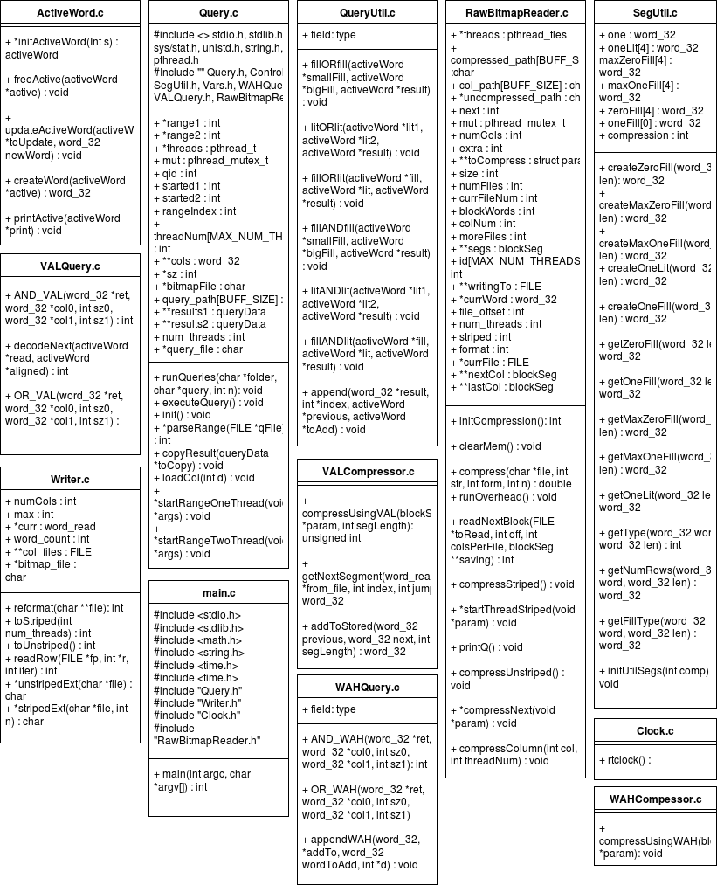

# Bitmap Engine
### [github.io](https://alexander-io.github.io/Bitmap-Engine/)
Original code contribution by [aingerson](https://github.com/aingerson/Bitmap-Engine) as a research assistant under the direction of Professor D.Chiu.

## Execution instructions
  First Navigate to the BitmapEngine/src/ directory...
  ... there you'll find a Makefile, so issue :

    $ make

  ^ the above command will generate a number of object files as well as an executable called 'main'.

  In order to remove the object files and the executable, issue :

    $ make clean

## References
  Research Article Title :
  Notes on Design and Implementation of Compressed Bit Vectors
  Authors : Kesheng Wu, Ekow J. Otoo, Arie Shoshani, Henrik Nordberg
  Date : September 27, 2001
